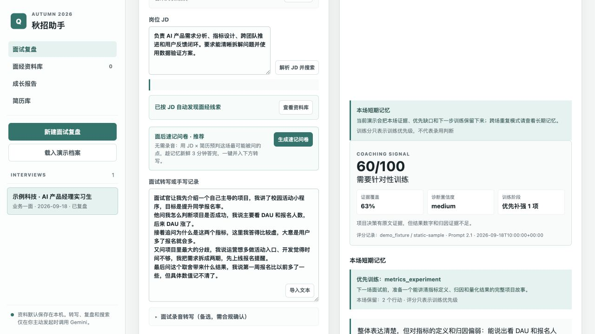
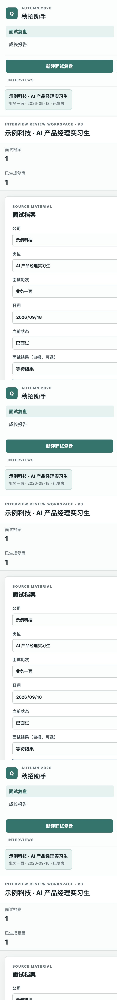
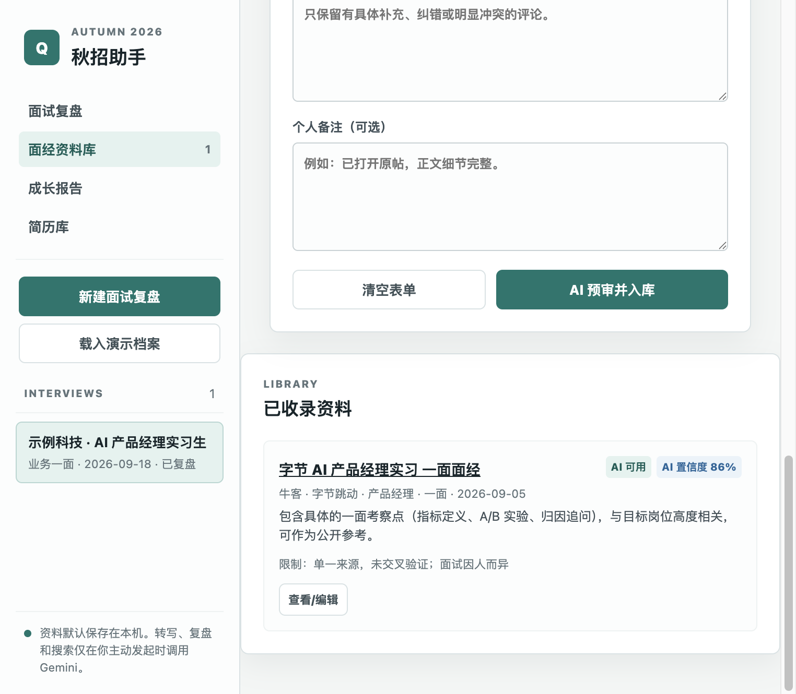
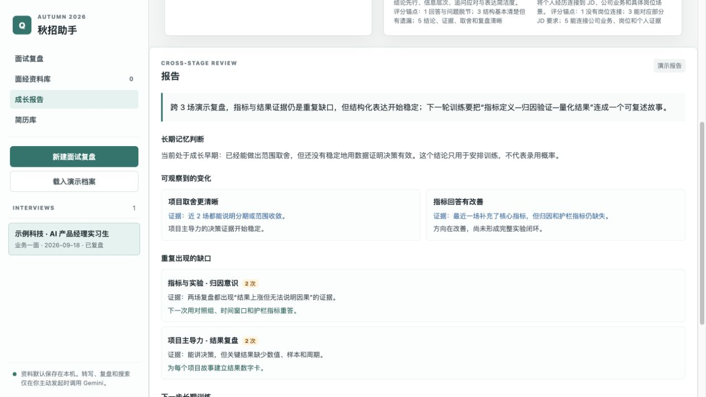

# 秋招助手 · Autumn PM Coach

> 一个**部署在本地**的产品经理面试复盘助手。它不做实时面试辅助——而是在面试结束后，
> 把你的转写整理成**带原文证据**的结构化复盘，判定外部面经资料是否可用，并跨多场面试
> 沉淀出重复出现的问题。

<p align="center">
  
</p>

- **在线只读演示**：<https://huggingface.co/spaces/Vergessne/autumn-pm-coach>
- **纯 Python 标准库**，无第三方依赖，本地一条命令即可运行
- **数据默认留在本机**，转写 / 复盘 / 搜索仅在你主动发起时才调用大模型

---

## 它解决什么问题

面试最大的浪费，是「面完就忘」：

- 面试当下紧张，记不清自己到底哪句答得虚、哪个追问没接住。
- 复盘全靠感觉，没有原文证据，容易自我安慰或过度否定。
- 面了十几场，却说不清自己在「指标定义」「项目主导力」这些能力上到底有没有进步。

这个工具把这条链路结构化，让每一场面试都能沉淀成可复算的成长信号：

```text
  面试录音 / 转写
        │  转写、导入（前处理）
        ▼
  单场 AI 复盘 ───────► 每条结论都带转写原文证据 + 六维能力评分 + 行动项
        │  落盘到本地记忆
        ▼
  确定性长期记忆 ─────► 统计重复薄弱点 / 能力均分变化 / 未完成行动项
        │  多场累积
        ▼
  阶段成长报告 ───────► 跨场趋势解读（须有证据，显式标注数据是否足够）

  面经资料库 ──（人工摘录 + AI 预审分级）──► 只有「可用 / 已确认」的资料才进复盘引用
```

---

## 这个项目和 AI 的关系

这不是一个「把问题丢给大模型、原样返回结果」的封装。AI 在这里是一个**受约束的分析器**：
它负责理解和归纳，但不掌握可信度——可信度由系统的确定性代码来保证。

| AI 负责 | AI **不**负责（硬边界） |
| --- | --- |
| 从转写里提炼结构化复盘 | 不碰副作用：AI 只输出文本，存储 / 鉴权 / 统计都由后端确定性代码完成 |
| 给公开面经做可用性预审 | 不凭空造证据：复盘每条证据必须能在转写原文里定位到，否则不展示 |
| 生成跨场趋势的文字解读 | 不把搜索结果当事实：外部资料要过「人工摘录 + AI 预审分级」门槛才可引用 |
| —— | 不编造趋势：跨场统计用可复算的计数 / 均分得出，不让 AI 拍脑袋给数字 |

一句话：**模型可以出错，但系统不会因此把错误当成事实。** 下面三个核心能力都是围绕这条原则设计的。

---

## 核心能力

### 一、面经资料的搜索与可用性判定

解决的问题：网上的面经真假难辨、时效性差、可能是营销，直接喂给 AI 就是在放大不可信信息。
所以这里给外部资料设了一道**证据门槛**：

1. **搜索只给线索**：用 Google Search 发现候选帖子的 URL / 标题 / 摘要，明确标注「这是发现，不是已验证证据」；返回的链接必须来自搜索引用，不允许模型编造 URL。
2. **强制人工摘录**：一条资料要被引用，必须先粘贴原帖正文（**≥80 字**），逼你真的打开原帖确认，而不是凭标题臆断。
3. **AI 三级分级**：`AI 可用`（置信度 ≥80 且有具体细节、无矛盾）/ `待确认` / `不使用`。即使模型给了「可用」，只要置信度 <80 也会被**强制降级**为待人工确认。
4. **评论只作弱信号**：匿名评论只能微调置信度，永远不能单独当作事实证明。
5. **可溯源 + 精准引用**：每条资料保留原链接与发布日期；生成复盘时优先引用与当前公司 / 岗位匹配的可用资料，泛用资料仅作兜底。

### 二、单场面试表现的评价

解决的问题：面试复盘最容易变成「模型夸夸其谈」。这里用**证据优先**把评价钉在事实上：

1. **输入当不可信数据**：转写、JD 在 prompt 里被显式声明为「待分析材料」，避免转写里夹带的指令劫持模型。
2. **固定结构产出**：总结 / 表现亮点 / 需要补强 / 六维 PM 能力诊断 / 逐题复盘 / 下一步行动项。
3. **证据逐条校验**：每条结论都要引用转写原文（含时间戳），后端会把证据拿去和转写做匹配，**定位不到的引用直接替换成「（无转写原文可佐证）」**，绝不让模型的判断性描述冒充原文。评分统一钳制到 1–5。

六维 PM 能力维度：

```text
产品判断 · 项目主导力 · 指标与实验 · 推进与协作 · 结构化表达 · 业务与岗位理解
```

### 三、跨多场面试的长期总结

解决的问题：单场复盘只看到「这一次」，真正的成长信号藏在「多场之间的重复」里。

1. **确定性长期记忆**：从所有**已复盘**的面试里，用统计（不是 AI）聚合出——重复出现的薄弱点计数、六维能力的平均分（按最弱排序）与最新分、未完成的行动项、面试时间线。
2. **阶段成长报告**：在上面这份可复算的记忆之上，让 AI 生成跨场趋势解读，但要求每条 pattern 都指名支撑它的面试 / 公司 / 轮次，并显式输出「哪些数据太少、不足以下结论」。
3. **不让 AI 编趋势**：数字和计数来自确定性统计，AI 只负责解释，避免把偶然当规律。

---

## 输入处理（录音转写 / 简历 / JD）

这几项是把原始材料变成结构化文本的**前处理**，实现相对直接，服务于上面三个核心能力，不展开：

- **录音转写**：上传录音，经 Gemini 转成带时间戳的文字（也可直接粘贴转写 / 导入 .txt / .md / .srt）。
- **简历解析**：上传 PDF / PNG / JPG / WebP，解析成可编辑文本，维护多个简历版本。
- **JD 提取**：粘贴岗位 JD，一键提取岗位画像（职责 / 要求 / 关键词 / 可能追问）。

> 联网资料发现与音频 / 文件解析走 Gemini 原生 API（Google Search / Files），文本备用模型无法完全替代这两项。

---

## 🚀 快速开始

需要 **Python 3.12+**（仅标准库，无需 `pip install`）。

```bash
# 1. 克隆仓库
git clone https://github.com/Vergessen428/project_resume.git
cd project_resume

# 2. 配置模型 Key（至少填一个供应商）
cp app/.env.example app/.env
#   编辑 app/.env，填入 GEMINI_API_KEY 或 OPENAI_API_KEY 等

# 3. 启动
python3 -B app/web_app.py
```

浏览器打开 <http://127.0.0.1:8765> 即可使用。服务只监听本机，`Ctrl-C` 停止。

> 本地不设口令时直接进入工作台；设置 `APP_ACCESS_TOKEN` 后需在登录框输入相同口令。
> 想快速看效果？进入工作台点 **载入演示档案**，会填充一份带完整复盘的示例。

---

## 🧭 使用流程

```text
① 新建面试        →  填公司 / 岗位 / 轮次，粘贴 JD（可一键提取岗位画像）
② 导入面试材料    →  上传录音自动转写，或直接粘贴带时间戳的转写 / 手写记录
③ 生成 PM 复盘    →  产出「表现亮点 / 需要补强 / 能力诊断 / 逐题复盘 / 行动项」，每条都带原文证据
④ 沉淀面经        →  在面经资料库录入公开原帖，AI 预审后作为可追溯参考
⑤ 阶段成长报告    →  跨多场面试提取重复薄弱点和能力变化
```

---

## 🖼️ 界面展示

**面试工作台**：左侧档案列表 + 顶部指标概览，右侧录入面试材料。



**带原文证据的复盘**：亮点 / 补强 / PM 能力诊断，每条结论都引用转写原文与时间戳。


**面经资料库**：搜索发现候选资料，录入原帖后经 AI 预审，标注可用状态与置信度。



**阶段成长报告**：跨场记忆快照，统计重复出现的薄弱点与六维 PM 技能。



---

## 🔀 多模型兜底

文本复盘、JD 提取、资料预审和阶段报告支持按顺序自动切换模型：

```text
Gemini → OpenAI → DeepSeek → OpenRouter → Custom (任意 OpenAI 兼容端点)
```

在 `app/.env` 填入至少两个供应商的 Key，按需修改 `MODEL_FALLBACK_ORDER`。未配置的供应商
会自动跳过。**只有**网络错误、超时、限流或 API 报错才会切换；模型正常返回的内容不会被覆盖。

---

## 🧱 技术栈

- **后端**：Python 3.12+ 标准库 `http.server`，零第三方依赖
- **前端**：原生 HTML / CSS / JS，无构建步骤
- **模型**：Gemini / OpenAI / DeepSeek / OpenRouter / 自定义 OpenAI 兼容端点
- **存储**：本地 JSON（原子写入 + 文件锁），默认 `.gitignore`
- **测试 / CI**：`unittest` + GitHub Actions（push / PR 自动跑）

```text
app/
  web_app.py          # HTTP 服务与路由、三级访问控制、限流
  core/
    model_provider.py # 从环境变量装配模型客户端（唯一 provider 装配点）
    models.py         # OpenAI 兼容 / Gemini / 多模型兜底，统一 complete(prompt)
    multipart.py      # 标准库 multipart 解析（替代已弃用的 cgi）
    interview_review.py / research_grounding.py / audio_transcription.py
    interview_store.py / resume_store.py / research_store.py / growth_memory.py / pm_skills.py
  web/                # 前端（原生 HTML/CSS/JS）
  data/               # 本地 JSON 数据（gitignore）
static_demo/          # 纯前端只读演示版（部署到 Hugging Face Static Space）
mini_agent_python/    # 配套教学：最小 Agent runtime（讲解 Agent 原理，非产品）
tests/                # 单元测试
docs/                 # 项目文档与界面截图
```

---

## 🔐 数据与隐私

- 面试记录、简历、面经默认保存在本机 `app/data/`（`interviews.json` 等），已被 Git 忽略。
- 三级访问控制：本地免密 / 公网需 `APP_ACCESS_TOKEN` / `APP_DEMO_MODE=1` 只读演示。
- 口令连错 5 次锁定 60 秒（按 IP 限流），防暴力破解。
- 上传的音频处理后即从临时目录删除。

---

## 🌐 部署

- **免费只读演示**：`static_demo/` 是纯前端 Mock 版，部署到 Hugging Face Static Space
  即可拿到公开可点的展示链接，见 [DEPLOY_HUGGINGFACE.md](./DEPLOY_HUGGINGFACE.md)。
- **完整功能部署**：带后端的动态部署见 [DEPLOY_RENDER.md](./DEPLOY_RENDER.md)。
  部署到公网时**务必设置 `APP_ACCESS_TOKEN`**。

## ✅ 测试

```bash
python3 -m pytest tests/ -q
```

## 👥 贡献者

- [**Vergessen428**](https://github.com/Vergessen428) — 项目作者
- **Codex** — AI 结对编程助手

## 📄 许可

个人项目，欢迎参考交流。
