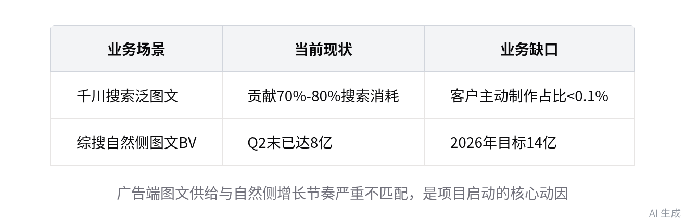
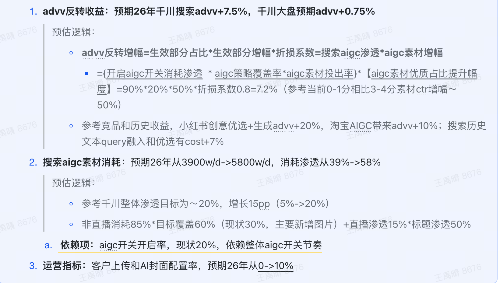
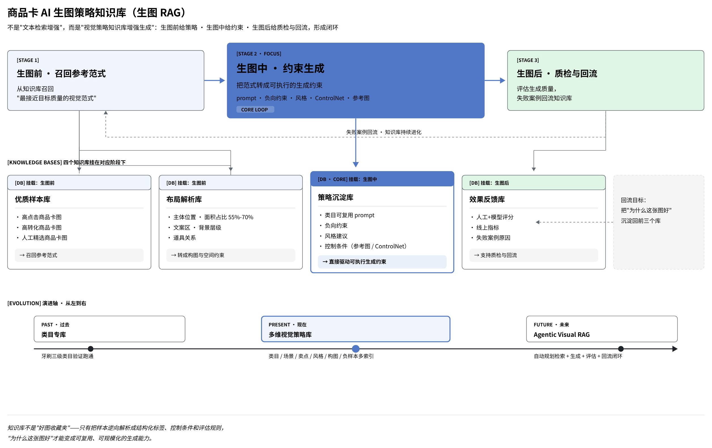
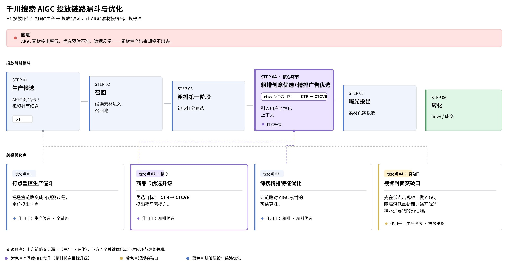
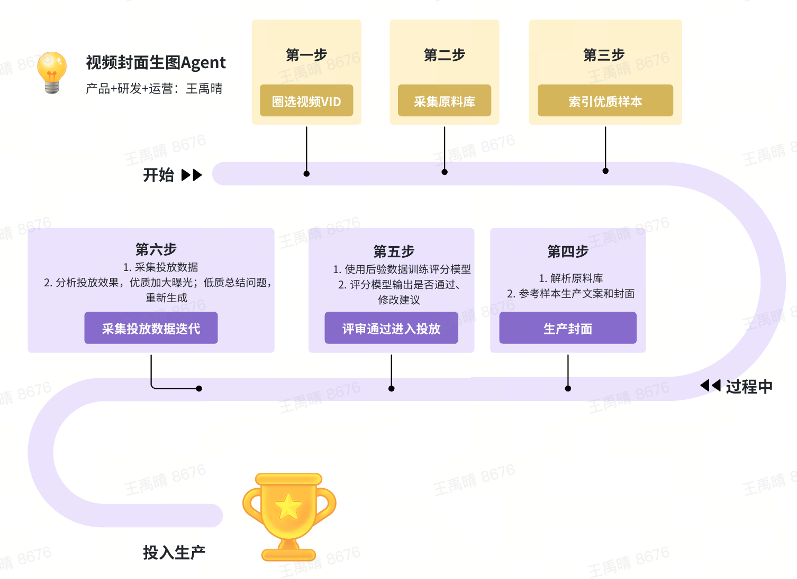

# 千川搜索图文 AIGC H1 复盘：生产链路框架与简历故事包装

来源：飞书妙记《千川流量产品AI讨论会》，2026-07-16 18:57-20:15
用途：把视频内容整理成一套可用于简历优化、面试讲述和追问防御的完整材料。

## 0. 一句话结论

这次分享最值得吸收的不是“如何写 prompt”，而是如何把一个看似玄学的创意问题，拆成一套可观测、可评测、可生产、可投放、可反馈的工程化产品系统。

如果用于包装你的简历，建议把 AIGC 商品卡项目从：

> 我做了商品卡 AIGC 质量评测和生成策略。

升级为：

> 我围绕广告收入目标，搭建 AIGC 素材生产治理链路：从收入目标拆解、创意效果归因、优质素材 Benchmark、红线机审、分场景生成路由，到投放链路诊断与后验反馈闭环，推动 AIGC 素材从人工调 prompt 升级为可评测、可路由、可迭代的工程化生产体系。

这句话的优势是：它把你从“会用 AI 工具的人”抬升为“能定义指标、组织链路、推动多方落地的产品策略 PM”。

## 0.1 最新简历口径

你最新简历里的 AIGC 部分已经从“机审准确率 / AIGC 优质率”的泛口径，收敛成两条更容易解释、也更贴近业务链路的结果：

```text
AIGC 商品卡素材供给：构建质量评测体系与生成路由策略，提升生图素材规模化可用性。

- 质量评测规则：圈选曝光 >1000 的商品，构建高低 CTR 商品 pair 对，总结提炼主体表现力等四维优质规则；从生图 badcase 总结，定义商品主体等五维红线规则，设计 OCR + 豆包 + Qwen 三层过滤，badcase 率从 41% 降至 7%。
- 素材生成策略：联动算法完善去白边、主体放大等基础素材优化能力，基于优质规则筛选样本总结行业特征，设计生成路由策略，差异化建设 RAG 图生图与行业 PE 文生图双链路，SBS 评估优质率从 25% 提升至 69%。
```

这版简历口径比旧版更好，因为它把项目拆成两个闭环：

- 质量侧闭环：样本约束 → 规则抽象 → 红线定义 → 三层过滤 → badcase 下降。
- 生成侧闭环：基础素材优化 → 优质样本筛选 → 行业特征总结 → 生成路由 → 双链路生成 → SBS 优质率提升。

后续所有面试表达都应该围绕这两个闭环展开，不再主讲“机审准确率 97.21%”或“AIGC 优质率 72.9%”这类旧口径，避免和最新版简历冲突。

## 0.2 可迁移方法论：从“素材好不好”到“规模化可用”

这份材料的方法论可以更明确地沉淀为一套通用 AI 生成类项目框架：

```text
业务目标
→ 稳定样本
→ 质量规则
→ 风险红线
→ 过滤链路
→ 生成路由
→ 评估验收
→ 反馈迭代
```

每一层解决一个不同问题：

| 层级 | 关键问题 | 本项目里的做法 | 可复用到其他 AI 项目的表达 |
| --- | --- | --- | --- |
| 业务目标 | 为什么做，不是为了炫技 | 提升生图素材规模化可用性，服务搜索广告图文供给 | 先定义 AI 能力要服务的业务结果 |
| 稳定样本 | 用什么样本定义好坏 | 圈选曝光 >1000 商品，构建高低 CTR 商品 pair | 先控制样本置信度，再抽象规则 |
| 质量规则 | 什么值得学 | 主体表现力等四维优质规则 | 把“审美判断”转成可评测维度 |
| 风险红线 | 什么必须拦 | 商品主体等五维红线规则 | 把“不能上线”的问题前置治理 |
| 过滤链路 | 怎么规模化控制质量 | OCR + 豆包 + Qwen 三层过滤 | 用低成本确定性能力 + 多模态模型分层兜底 |
| 生成路由 | 不同场景怎么生成 | RAG 图生图与行业 PE 文生图双链路 | 不用一套 prompt 打所有场景 |
| 评估验收 | 怎么证明变好 | badcase 率 41%→7%，SBS 优质率 25%→69% | 同时看风险下降和质量提升 |
| 反馈迭代 | 怎么持续变好 | badcase 回流规则，优质样本回流生成策略 | 让评测结果反哺下一轮生产 |

这套方法论的核心不是“用了哪个模型”，而是把 AI 生成项目从一次性产图改造成一个可治理的生产系统。

## 1. 视频里完整的业务思路框架

### 1.1 为什么要做：搜索广告有明确的图文供给缺口

视频开头先证明项目必要性，而不是直接讲方案。

核心背景：

- 千川搜索场景下，泛图文素材，包括商品卡、图集、以封面为搜索结果呈现的视频，占千川搜索消耗约 70%-80%。
- 客户主动为搜索制作专属图文素材的比例极低，历史上客户自提视频封面消耗占比低于千分之一。
- 综搜自然侧在快速提升图文供给，2026 年目标从 5 亿图文 BV 提升到 14 亿，Q2 末已到 8 亿，占比约 30%。广告侧如果不补图文供给，会和自然侧的内容形态演进脱节。



简历包装启发：

不要把项目起点讲成“我们想做 AIGC 生图”。更好的起点是：

> 搜索广告的核心载体正在图文化，但客户侧缺乏为搜索意图单独生产图文素材的动力，导致广告端意图内容供给不足。我负责把这个供给缺口转化成可衡量、可生产、可投放的 AIGC 素材治理链路。

### 1.2 北极星不是图片质量，而是广告收入

视频中最关键的一层抽象是：AIGC 创意业务不能只看“图好不好看”，它最终要服务广告收入。

但创意和收入之间不是直接关系。收入会受到商品力、出价、位置、样式、流量、投放链路、冷启动等多因素影响。因此需要把北极星拆成可做功的中间指标。

视频中的拆解是：

```text
收入增长 = 生产覆盖 × 投出覆盖 × 素材增效
```

进一步解释：

- 生产覆盖：有多少广告可生产素材，生产成功率有多高，生产效率能否支撑规模化覆盖。
- 投出覆盖：生成素材是否过审，是否进入 inspire，是否被优选模型选出，是否通过精排/混排实际投出。
- 素材增效：投出的 AIGC 素材相比非 AIGC 或低质量素材，是否带来点击、转化、收入提升。



简历包装启发：

你现在简历里的“质量评测规则”和“素材生成策略”可以上升到这个框架下：

```text
围绕“生产覆盖 × 投出覆盖 × 素材增效”拆解 AIGC 素材提效路径：
生产侧沉淀优质规则和分场景生成路由，提升可用素材供给；
评测侧抽象四维优质标准和五维红线标准，保障素材质量；
投放侧结合机审、人工 review 与优选模型，推动优质素材进入投放链路。
```

### 1.3 为什么难：CTR 不能直接代表创意质量

视频里反复强调，创意项目最难的是“怎么证明是创意带来的效果”。

传统 CTR 有几个问题：

- 点击可能来自封面，也可能来自卡片内组件、标题、价格、卖点、商品本身。
- 同一个图片在不同 query、位次、样式下表现可能差异很大。
- 商品价格、品牌、出价、预算、计划状态都会影响后验。
- 初期 AIGC 样本少，纯靠后验数据无法形成稳定结论。

因此，视频里的方法是“双轮驱动”：

- 先验业务判断：结合用户侧经验、行业认知、产研判断、竞品样本，先定义一版可执行框架。
- 后验数据驱动：通过同 query、同位次、同样式下的正负样本 pair 和线上后验表现，不断校准标准和权重。

可以概括为：

```text
不能只靠人拍脑袋，也不能只信低样本后验。
先用业务先验搭框架，再用后验数据校准，最后让框架反过来指导生产。
```

简历包装启发：

这能帮助你解释“为什么你用高低 CTR 商品 pair 定义规则”：

> 我没有直接拿全量 CTR 做规则，因为 CTR 里混入了位置、样式、商品力和组件点击。我的处理是先收束样本空间，用高低 CTR 商品 pair 或同类目/同商品对照尽量剥离混杂因素，再从稳定差异中抽象主体表现力、信息传达力、设计氛围、真实可信度等维度。

## 2. 完整生产链路：从样本到投放的闭环

### 2.1 总览：AIGC 素材生产不是单点 prompt，而是六段链路

可以把视频里的完整链路整理为六段：

```text
业务目标拆解
→ 数据基建与样本提取
→ Benchmark / 红线标准
→ 四库一体生成链路
→ 候选筛选与投放链路
→ 后验反馈与风险治理
```

每一段都有产品可做的事情：

| 环节 | 解决的问题 | 产品动作 | 简历可包装点 |
| --- | --- | --- | --- |
| 目标拆解 | 为什么做、做到什么程度 | 将收入拆为生产覆盖、投出覆盖、素材增效 | 有业务目标拆解能力 |
| 数据基建 | 怎么看见素材真实效果 | 建封面点击率、外流点击率、ADlog 素材观测 | 有指标和数据基建意识 |
| 标准体系 | 什么叫好图、什么不能投 | 四维优质规则、五维红线规则 | 有 Benchmark 和治理能力 |
| 生成链路 | 如何规模化生成好素材 | 样本库、解析库、指令库、反馈库 | 有 AI 产品工程化能力 |
| 投放链路 | 生成后能否投出去 | 过审、inspire、精排、混排漏斗排查 | 有端到端落地能力 |
| 反馈治理 | 如何持续迭代且不出风险 | 后验拟合、reward、品牌/明星/黑词拦截 | 有闭环和合规意识 |

### 2.2 第一段：数据基建和样本提取

视频里提到，项目初期“创意基建为 0”，主要问题包括：

- 原始 CTR 指标不可直接解释创意质量。
- 实际投出的素材无法直接查看。
- 素材存储是加密 URI，需要解析工具才能看到图。
- 创编侧素材不等于最终 ADlog 真实展示素材，中间可能经过替换、优选、链路处理。

因此先补数据基建：

- 构建封面点击率、外流点击率等细分指标。
- 打通 ADlog 真实投放素材观测。
- 建 AIGC 创意监控看板。
- 建 AI 辅助优质样本提取工具。
- 建自助实验分析数据集，减少对 DS 的依赖。
- 建生产 workflow 和原料库，让产品侧能自主生产/分析。

简历包装方式：

```text
补齐 AIGC 素材数据基建：打通真实投放素材与后验效果观测，沉淀素材质量监控、样本提取和实验分析工具，使产品侧可自主完成优质样本圈选、badcase 归因和策略迭代。
```

### 2.3 第二段：优质 Benchmark 和红线标准

视频里对 Benchmark 的定义很重要：

> Benchmark 不是一条水位线，而是围绕业务指标，把抽象目标翻译成维度框架、评分细则和可执行评测集。

视频里的方法是：

1. 先定义目标：广告收入提升。
2. 再定义纲领：高置信、高转化、创意驱动含量高。
3. 再定义维度：哪些视觉/信息/布局因素影响创意质量。
4. 再定义评分规则：不同维度怎么打分。
5. 最后形成评测集：用于指导训练、生产、筛选、机审。

你的简历材料已经有一套很好承接：

- 优质规则：主体表现力、信息传达力、设计与氛围、真实可信度。
- 红线规则：法务红线、文字元素、品牌标识、商品主体、人物形态。
- 过滤结果：通过 OCR + 豆包 + Qwen 三层过滤，将 badcase 率从 41% 降至 7%。
- 生成结果：通过 RAG 图生图与行业 PE 文生图双链路，使 SBS 评估优质率从 25% 提升至 69%。

建议面试中把规则讲成“四层产物”：

| 层级 | 你的产物 | 作用 |
| --- | --- | --- |
| 优质打分 | 四维优质规则 | 判断什么值得学习、进入样本库 |
| 红线拦截 | 五维 P0/P1 红线 | 判断什么不能投、必须重生成或过滤 |
| 过滤链路 | OCR + 豆包 + Qwen 三层过滤 | 把红线规则变成可规模化执行的质量闸口 |
| 生成动作 | 去白边、主体放大、RAG 图生图、行业 PE 文生图 | 把评测结果变成下一轮生成策略 |

这句话可以直接背：

> 我的规则不是审美描述，而是生产控制系统。优质规则回答“什么值得学”，红线规则回答“什么必须拦”，三层过滤回答“怎么规模化拦”，生成路由回答“下一轮怎么生产”。

### 2.4 第三段：四库一体生成链路

视频里的核心生产范式是“四库一体”：

```text
优质样本库 → 布局解析库 → 策略指令库 → 效果反馈库
```



结合你最新版简历，这一段不要只讲“四库”，还要把它翻译成你实际做的“生成路由策略”：

```text
基础素材优化能力
→ 优质样本筛选
→ 行业特征总结
→ 生成路由判断
→ RAG 图生图 / 行业 PE 文生图
→ SBS 评估验收
```

这里的关键是：你不是直接上来做复杂生成，而是先把基础素材能力补齐。去白边、主体放大这类能力看起来不性感，但它们解决的是商品卡素材最基础的可用性问题：主体是否清楚、画面是否干净、商品是否能被用户快速识别。基础可用性不解决，后面的 RAG、PE、模型升级都容易变成在低质输入上做装饰。

四个库分别解决不同问题：

1. 优质样本库

   来源包括站内优质投放素材、竞品高互动素材、人工筛选样本、不同类目下的正负样本 pair。

   作用是回答：

   > 什么样的图值得模型学习？

2. 布局解析库

   将优质样本拆成结构化 JSON，例如：

   - 文案内容是什么。
   - 文案类型是什么。
   - 文案位置在哪里。
   - 版式结构是什么。
   - 背景、画风、商品主体、营销元素如何组织。

   作用是回答：

   > 好图到底好在哪里，哪些部分可以迁移？

3. 策略指令库

   用通用 PE 底座 + 类目/场景布局解析 + 商品信息，生成可执行的生图指令。

   视频里提到，商品卡链路会吞入：

   - 商品白底图/主图。
   - 商品信息。
   - 布局解析。

   再吐出用于生图的 meta 指令。

   作用是回答：

   > 如何把结构化经验翻译成模型能执行的任务？

4. 效果反馈库

   用线上投放后验、SBS、模型打分、人工 review 反向迭代样本、权重、解析规则和指令。

   视频里明确说：前三个库已相对自动化，第四个效果反馈库仍偏半手动，后续方向是 reward 和自动化闭环。

   作用是回答：

   > 哪些生成策略真的有效，下一轮该强化什么？

简历包装方式：

```text
基于优质规则筛选样本并总结行业特征，先联动算法完善去白边、主体放大等基础素材优化能力，再按场景设计生成路由：复杂参考/搭配场景走 RAG 图生图，行业特征明确、版式可结构化沉淀的场景走行业 PE 文生图，最终通过 SBS 评估验证优质率从 25% 提升至 69%。
```

这一段在面试中要讲清楚三个判断：

- 为什么先做基础素材优化：因为主体清晰和画面干净是商品卡可用性的底线。
- 为什么要做生成路由：因为不同类目、不同素材状态、不同风险水平，不适合用同一套生成方式。
- 为什么用 SBS 验收：因为生成素材质量很难单靠单张图主观判断，需要和原图/旧策略/候选策略对比。

### 2.5 第四段：生成候选、模型打分、人工 review、优选投放

视频里有一个关键讨论：一次生成不是只生成一张图，而是生成多张候选图。

处理逻辑：

- 一次生成多个候选。
- 模型先打分，可能选 Top 3。
- 人工抽检模型打分是否准。
- 尽可能多投，因为候选越多，站内优选模型越容易选出有效素材。
- 最终线上仍依赖优选模型、精排、混排完成分发。

这点很重要，因为它说明生成策略不是“生成即上线”，而是“生成候选池 + 评估筛选 + 投放优选”。

简历包装方式：

```text
构建候选生成与筛选机制：单商品生成多组候选素材，结合模型初筛、人工抽检与站内优选模型扩大可投候选池，提升 AIGC 素材进入投放链路的概率。
```

### 2.6 第五段：投放链路漏斗诊断

视频后半段强调：素材生成出来，不等于投得出去。

投放端的关键问题是投出率低。解决方式是把投放链路拆成漏斗，逐节点排查。



视频中提到的典型动作：

- 发现 inspire 环节过滤过多 AIGC 素材，推动优选模型优化。
- 从单一 CTR 判定调整到 CTR + CTCVR。
- 增加 embedding 特征优化优选模型。
- 用“一模一样图片只改一个像素”的实验判断是不是链路 bug。
- 排查精排、混排等链路问题。

简历包装方式：

```text
不止关注离线素材质量，还拆解 AIGC 素材从生成、过审、inspire、精排到混排的投放漏斗，定位优选模型与链路 bug，推动素材从“可生成”走向“可投出、可增效”。
```

### 2.7 第六段：冷启动破局与局部收益验证

当全链路资源不足、投出率不稳定时，视频里给出了一种产品破局方式：

- 不等全链路完美。
- 先找高敏感行业：服饰、家居、3C、美妆等。
- 产品侧自主生图。
- 定向给客户测试。
- 拿到点击率提升数据。
- 再用数据说服技术和业务投入。



这对你的面试很有价值，因为它体现 PM 的推进能力：

> 在资源不足、主链路暂时无法全量验证时，我会先选择素材敏感、基线较低、收益空间更大的行业做局部验证，用小闭环数据证明策略有效，再推动工程资源进入全链路建设。

## 3. 大家讨论聚焦点与关键启发

### 3.1 讨论焦点一：创意驱动含量怎么定义？

趁雨追问“创意驱动含量高”如何从数据上限定。

回答的核心是：收束点击来源。

- CTR 太泛，可能来自内流组件、标题、商品、卡片其他区域。
- 因此要看封面点击率、外流点击率。
- 还要结合 query、位次、样式、曝光置信度。
- 如果封面点击和外流点击 diff 很大，要单独揪出来看，甚至不作为置信样本。

对你简历的启发：

面试官如果质疑“你用高低 CTR pair 定规则是不是太粗”，你可以回答：

> 是的，所以我不会直接把 CTR 等同于创意质量。我的处理思路是尽量收束样本空间和行为口径：控制商品/类目/流量位置等因素，再看高低表现 pair 中稳定出现的视觉和信息表达差异。CTR 只是样本筛选入口，最终规则还要经过人工 review、badcase 校验和机审一致性验证。

### 3.2 讨论焦点二：Benchmark 权重怎么定？

大家追问营销元素 37%、画风设计 33% 这类权重是不是后验拟合出来的。

结论：

- 权重不是拍脑袋，也不是追求数学最优。
- 先由业务经验给几组候选。
- 再和线上后验拟合。
- 选择相对更相关、更有区分度的一组。
- 线上环境变化后，权重要周期性更新。

对你简历的启发：

如果你讲四维规则，最好不要只讲规则名，要讲规则怎么校准：

> 初版规则来自高低 CTR pair 和业务先验；后续会用 SBS 标注、机审一致性和线上表现做校准。如果某些维度与后验相关性下降，就需要调整权重或重写评分细则。

### 3.3 讨论焦点三：新业务怎么设计评测维度？

晓彤问面对新业务怎么找维度。

视频里的方法：

- 如果有前人经验，先站在用户侧/业务侧已有框架上。
- 再结合业务判断补充维度。
- 再让多个模型扩散可能维度。
- 最后由业务方一起 review 收敛。

这可以总结成：

```text
业务先验定方向，AI 扩散补盲区，后验数据做校准。
```

这句话对你讲 Agent / AIGC 都很有用，因为它把 AI 放在合理位置：不是替代业务判断，而是放大知识搜索和结构化能力。

### 3.4 讨论焦点四：四个库是不是每次都被 RAG 检索？

趁雨和韦炜多次追问样本库、布局解析库、策略指令库之间的关系。

最终澄清：

- 样本库是原图和案例。
- 布局解析库是从样本中抽出来的 JSON。
- 策略指令库把布局解析和商品输入翻译成生图指令。
- 实际生产主要调用结构化解析和指令，不一定每次直接读取原图。
- 效果反馈库当前还没有完全自动化。

对你简历的启发：

不要泛泛写“RAG 图生图”。更准确：

> RAG 的价值不只是把参考图塞给模型，而是把优质样本结构化为可检索、可迁移、可复用的版式和表达知识，再由 PE 组织成生图任务。

### 3.5 讨论焦点五：PE 和模型能力如何分工？

韦炜问哪些靠 PE，哪些必须靠模型升级。

视频里的回答很适合面试：

- 模型像“学了很多知识的学生”，决定能力上限。
- 指令是任务说明，决定模型如何被调用。
- 强模型可以用较简单指令生成不错结果。
- 弱模型即使指令很细，也会出现文字渲染、结构一致性、遵循度问题。
- 文字乱码、底层渲染、复杂商品一致性，很难靠 prompt 完全解决，必须依赖基座模型升级或微调。

对你简历的启发：

如果面试官问“你做的是不是只是写 prompt”，你可以回答：

> 不是。Prompt 只是策略执行层。我做的是把业务目标、样本标准、红线约束和类目知识结构化后注入生成链路。PE 能解决任务约束和信息组织，但文字渲染、商品一致性、人物形态这类底层能力仍需要模型升级和训练数据配合，所以我也联动算法做机审模型和 badcase 回流。

### 3.6 讨论焦点六：风险治理要前置

视频最后讨论了明星侵权、品牌侵权、黑词、品牌库过滤。

关键结论：

- AIGC 广告素材合规风险不能等上线前再看。
- 明星肖像、品牌表达、适用关系、商标/logo 都可能出问题。
- 需要黑词、品牌库、法务红线、商安策略共同兜底。

对你简历的启发：

你五维红线规则里的“法务红线、品牌标识”不是小项，而是很重要的 PM 成熟度体现。

可以这样讲：

> 对广告 AIGC 来说，低质图只是效果问题，侵权图是业务风险。因此我把红线规则独立于优质评分，采用 P0/P1 分级拦截，优先保障法务、品牌、商品一致性和人物形态安全。

## 4. 如何包装你的简历故事

### 4.1 推荐主线：从“素材生成”改成“素材生产治理”

你的故事不要按“我做了规则、我做了 RAG、我做了机审”平铺，而要按产品链路讲：

```text
业务缺口
→ 指标拆解
→ 样本与规则
→ 生成路由
→ 质量过滤
→ 投放验证
→ 反馈迭代
```

一版完整讲述如下：

> 千川搜索场景里，图文素材贡献了核心广告消耗，但客户侧几乎不会专门为搜索意图制作图文素材，导致广告端图文供给不足。我负责的不是单点生图，而是 AIGC 素材生产治理链路。
>
> 第一，在质量评测侧，我先圈选曝光大于 1000 的商品，构建高低 CTR 商品 pair 对，从相对稳定的正负样本差异中提炼主体表现力等四维优质规则；同时从生图 badcase 中抽象商品主体等五维红线规则，再设计 OCR、豆包、Qwen 三层过滤，把 badcase 率从 41% 降到 7%。第二，在素材生成侧，我没有直接做单一 prompt，而是先联动算法补齐去白边、主体放大等基础素材优化能力，再基于优质规则筛选样本、总结行业特征，设计生成路由：复杂参考/搭配场景走 RAG 图生图，行业特征明确的场景走行业 PE 文生图，最终 SBS 评估优质率从 25% 提升到 69%。

### 4.2 简历条目建议版本

最新版简历已经压缩成两条，这个方向是对的。不要再拆成三条，否则一页简历会显得过重。建议保持“两条 bullet + 一个总标题”的结构。

当前简历版本：

```text
AIGC 商品卡素材供给：构建质量评测体系与生成路由策略，提升生图素材规模化可用性。

- 质量评测规则：圈选曝光 >1000 的商品，构建高低 CTR 商品 pair 对，总结提炼主体表现力等四维优质规则；从生图 badcase 总结，定义商品主体等五维红线规则，设计 OCR + 豆包 + Qwen 三层过滤，badcase 率从 41% 降至 7%。
- 素材生成策略：联动算法完善去白边、主体放大等基础素材优化能力，基于优质规则筛选样本总结行业特征，设计生成路由策略，差异化建设 RAG 图生图与行业 PE 文生图双链路，SBS 评估优质率从 25% 提升至 69%。
```

如果还想让表达更硬一点，可以小幅升级为：

```text
- 质量评测规则：圈选曝光 >1000 商品构建高低 CTR pair，对比提炼主体表现力、信息传达力等四维优质规则；从生图 badcase 中沉淀商品主体、文字元素等五维红线规则，设计 OCR + 豆包 + Qwen 三层过滤链路，推动 badcase 率从 41% 降至 7%。
- 素材生成策略：联动算法完善去白边、主体放大等基础素材优化能力，基于优质规则筛选样本并沉淀行业特征，设计分场景生成路由，差异化建设 RAG 图生图与行业 PE 文生图双链路，SBS 评估优质率从 25% 提升至 69%。
```

### 4.3 面试 2 分钟讲法

```text
这个项目我会定义为 AIGC 商品卡素材生产治理，而不是单纯生图。

背景是千川搜索里图文素材贡献了很高消耗，但客户几乎不会为搜索意图单独生产素材，广告端存在明显供给缺口。我的目标不是让图更好看，而是围绕收入提升，拆成生产覆盖、投出覆盖和素材增效三个抓手。

我主要做了两块。第一是评测治理。我基于高低 CTR 商品 pair 去找高表现素材和低表现素材的稳定差异，抽象出主体表现力、信息传达力、设计氛围、真实可信度四维优质规则；同时从生图 badcase 中沉淀法务、文字、品牌、商品主体、人物形态五维红线规则。这样优质规则决定什么值得学，红线规则决定什么必须拦，原因标签还能回流到生成策略和机审模型。

第二是生成路由。我没有把链路做成单一 prompt，而是先补齐去白边、主体放大等基础素材优化能力，再按场景拆生成方式。复杂参考/搭配类场景适合 RAG 图生图，行业特征明确、规则可结构化沉淀的场景适合行业 PE 文生图。最终形成候选生成、三层过滤、SBS 评估和策略回流的链路。

结果上，质量侧 badcase 率从 41% 降到 7%，生成侧 SBS 评估优质率从 25% 提升到 69%。更重要的是，这个项目把 AIGC 从“能生成”推进到“可评测、可路由、可过滤、可迭代”。
```

### 4.4 30 秒电梯版

```text
我做的是千川搜索 AIGC 商品卡素材供给链路。评测侧用曝光 >1000 的高低 CTR 商品 pair 和生图 badcase，沉淀四维优质规则、五维红线规则，并通过 OCR + 豆包 + Qwen 三层过滤把 badcase 率从 41% 降到 7%；生成侧联动算法补齐去白边、主体放大等基础能力，再设计 RAG 图生图与行业 PE 文生图双链路，SBS 优质率从 25% 提升到 69%。
```

## 5. Grill-me：尖锐追问与防御答案

### Q1：你说高低 CTR pair，怎么证明不是商品本身好，而是图片好？

不好的回答：

> 高 CTR 的图片就是好图片。

更好的回答：

> 我不会直接把 CTR 等同于图片质量。CTR 只是样本筛选入口，后续要尽量控制混杂因素，比如同商品或同类目、相似价格带、相似流量位、相近曝光量和投放状态。真正进入规则沉淀的是 pair 中稳定出现的视觉表达差异，并且还要经过人工 review、badcase 校验和机审一致性验证。这个项目里最重要的就是把“后验表现”转成“可解释、可复用的创意维度”，而不是简单迷信 CTR。

### Q2：四维优质规则是不是拍脑袋？

回答：

> 初版一定有业务先验，但不是纯拍脑袋。我的方法是先用高低 CTR pair 圈出正负样本，再看高表现样本相对低表现样本在主体、信息、设计、真实感上的稳定差异；同时结合用户侧已有素材标准、竞品样本和模型扩散出的维度，形成初版规则。后续再用 SBS 标注、线上后验和机审一致性来校准。所以它是先验和后验结合，不是一次性定死。

### Q3：你做的到底是产品工作，还是算法/研发工作？

回答：

> 我的核心是产品策略工作：定义业务目标、拆指标、设计评测规则、抽象原因标签、设计生成路由和验收标准。算法负责模型训练和能力实现，研发负责链路工程化。我提供的是让算法和研发能做功的目标、样本、规则和反馈机制。比如机审模型训练需要什么标签、P0/P1 怎么定义、哪些 badcase 必须拦、哪些类目走哪条生成路由，这些都是产品策略输入。

### Q4：你是不是只是在写 prompt？

回答：

> 不是。Prompt 是最终执行层的一部分，但项目重点是把业务经验结构化。上游要有曝光 >1000 的稳定样本、高低 CTR pair、四维优质规则和五维红线规则；中间要有去白边、主体放大等基础素材优化能力，以及 RAG 图生图 / 行业 PE 文生图的路由判断；下游还要有 OCR + 豆包 + Qwen 三层过滤和 SBS 评估。单纯调 prompt 很难规模化，也很难解释为什么有效；我的工作是把它变成可评测、可路由、可过滤、可迭代的生产链路。

### Q5：为什么要同时做 RAG 图生图和行业 PE 文生图？

回答：

> 因为不同素材场景的输入条件和生成难点不同。RAG 图生图适合参考信息复杂、需要保留商品主体或借鉴优质样本结构的场景，它的价值是把优质样本、行业特征或搭配知识检索出来，降低模型自由发挥带来的不稳定。行业 PE 文生图适合行业特征比较明确、版式和卖点表达可以结构化沉淀的场景，成本更低、链路更轻。分路由的目的不是为了显得技术复杂，而是避免用一套 prompt 打所有场景，导致效果和风险都不可控。

### Q6：badcase 率 41%→7% 和 SBS 优质率 25%→69% 分别是什么？

建议回答口径：

> 这两个指标分别对应质量治理和生成效果，不能混讲。badcase 率 41%→7% 衡量的是低质/风险素材被三层过滤和规则治理后明显下降，核心看的是“不能投、不能放量”的问题减少。SBS 优质率 25%→69% 衡量的是生成策略相对旧策略或对照样本的优质判断提升，核心看的是“生成出来的素材是否更值得用”。前者是风险下降，后者是质量提升；它们共同支撑“规模化可用性”，但都不能直接等同于最终收入。

### Q7：为什么要做 OCR + 豆包 + Qwen 三层过滤，一个模型不能全做吗？

回答：

> 三层过滤不是重复判断，而是分层处理不同风险。OCR 适合处理文字识别、乱码、错别字、卖点露出等确定性问题，成本低、可解释性强；豆包这类多模态模型更适合判断主体完整性、画面质量、基础语义一致性；Qwen 则可以承接更复杂的规则推理和多模态一致性判断。单模型全做的问题是成本高、解释性弱、误判后难定位原因。分层过滤能把 badcase 原因拆开，也方便把问题回流到生成策略。

### Q8：如果模型基座能力不够，你的 PE 有什么价值？

回答：

> PE 不能突破所有模型能力上限，但它能让模型在既有能力内更稳定地完成任务。比如商品信息、卖点、背景、版式、布局解析这些结构化输入，可以显著减少任务歧义。但文字渲染、复杂商品一致性、人物形态这类底层能力，确实需要模型升级或微调。所以我会把问题拆开：任务约束和业务知识靠 PE/规则解决，底层生成能力靠模型升级，风险兜底靠机审和红线过滤。

### Q9：你怎么证明这个项目能带来收入？

回答：

> 收入不是单点图片质量能直接证明的，所以我会拆成链路指标。先看生产覆盖，是否能生成足够多可用素材；再看投出覆盖，是否能过审并进入投放链路；再看素材增效，投出后是否提升点击或转化。这个项目的贡献在于先把素材质量和供给能力做上来，并通过局部行业、SBS 或客户测试验证效果，再推动进入更完整的投放收益验证。

### Q10：这个项目最大的风险是什么？

回答：

> 最大风险有两个。第一是效果归因风险，创意效果容易被商品力、位置、样式、出价混淆，所以需要严格控制样本和指标口径。第二是合规风险，AIGC 容易出现明星肖像、品牌标识、商品不一致、文字违规等问题，所以红线规则必须前置，并和机审、人工 review、品牌库、黑词策略结合。

### Q11：曝光 >1000 的阈值是不是随便定的？

回答：

> 这个阈值的意义不是说 1000 一定是统计学上唯一正确的数，而是为了先过滤掉低曝光带来的随机波动。创意规则如果建立在低曝光样本上，很容易把偶然点击当成稳定偏好。曝光阈值的作用是保证样本有基本置信度，再结合高低 CTR pair、人工 review 和 badcase 校验抽象规则。如果面试官继续追问，我会补充说这个阈值后续可以根据样本量、类目流量和置信区间继续调整。

### Q12：SBS 优质率是主观评估吗，怎么保证可信？

回答：

> SBS 本身包含人工判断，所以不能把它说成绝对客观指标。它的价值在于用相同商品或相近场景下的 side-by-side 对比，减少单张图主观审美的波动。为了提升可信度，需要明确优质判断标准，比如主体表现力、信息传达力、设计氛围、真实可信度；同时让标注人基于同一套规则判断，并用 badcase、线上后验或抽检结果做校准。因此 SBS 是生成策略验收指标，不是最终收入指标。

## 6. 面试中最该主动讲的三个高级点

### 6.1 主动讲“我没有迷信 CTR”

这会显得你真的懂策略。

推荐表达：

> CTR 是入口，不是答案。它帮我找到可能有效的样本，但真正沉淀规则时，我会尽量控制 query、位次、样式、商品属性和曝光置信度，再结合人工 review 找稳定差异。

### 6.2 主动讲“规则不是文档，是控制系统”

推荐表达：

> 四维优质规则和五维红线规则不是写完给人看的标准，而是贯穿样本筛选、三层过滤、生成路由和 badcase 回流的控制系统。它既决定什么样本值得学，也决定什么素材必须拦，还会影响下一轮到底走 RAG 图生图还是行业 PE 文生图。

### 6.3 主动讲“从 prompt 到工程化链路”

推荐表达：

> 单点 prompt 调优边际收益很快下降，所以我更关注生产范式升级：先补齐去白边、主体放大这类基础素材优化能力，再把优质样本和行业特征转成可复用的生成路由，最后用 SBS 和 badcase 回流迭代。这样才能规模化，而不是靠人工经验逐图调参。

## 7. 你当前简历的修改建议

当前版本：

```text
AIGC 商品卡素材供给：构建质量评测体系与生成路由策略，提升生图素材规模化可用性。

- 质量评测规则：圈选曝光 >1000 的商品，构建高低 CTR 商品 pair 对，总结提炼主体表现力等四维优质规则；从生图 badcase 总结，定义商品主体等五维红线规则，设计 OCR + 豆包 + Qwen 三层过滤，badcase 率从 41% 降至 7%。
- 素材生成策略：联动算法完善去白边、主体放大等基础素材优化能力，基于优质规则筛选样本总结行业特征，设计生成路由策略，差异化建设 RAG 图生图与行业 PE 文生图双链路，SBS 评估优质率从 25% 提升至 69%。
```

建议版本：

```text
AIGC 商品卡素材供给：构建质量评测体系与生成路由策略，提升生图素材规模化可用性。

- 质量评测规则：圈选曝光 >1000 商品构建高低 CTR pair，对比提炼主体表现力、信息传达力等四维优质规则；从生图 badcase 中沉淀商品主体、文字元素等五维红线规则，设计 OCR + 豆包 + Qwen 三层过滤链路，推动 badcase 率从 41% 降至 7%。
- 素材生成策略：联动算法完善去白边、主体放大等基础素材优化能力，基于优质规则筛选样本并沉淀行业特征，设计分场景生成路由，差异化建设 RAG 图生图与行业 PE 文生图双链路，SBS 评估优质率从 25% 提升至 69%。
```

这版可以继续优化的点不是再加新 bullet，而是在面试中把两条 bullet 分别展开成两个闭环：

```text
质量闭环：曝光阈值筛样本 → 高低 CTR pair → 四维优质规则 → 五维红线规则 → 三层过滤 → badcase 下降。
生成闭环：基础素材优化 → 优质样本筛选 → 行业特征沉淀 → 生成路由 → 双链路生成 → SBS 优质率提升。
```

## 8. 最后给你的故事定位

你应该把自己定位成：

> 能把 AI 能力接入真实广告业务链路的产品策略 PM。

不是：

> 会写 prompt 的 AIGC 产品实习生。

你的差异化能力是：

- 能识别业务缺口：搜索图文供给不足。
- 能拆目标：收入拆成生产覆盖、投出覆盖、素材增效。
- 能建标准：四维优质规则、五维红线规则。
- 能做路由：服饰/非服饰、图生图/结构化 PE、机审/人工 review。
- 能推动落地：联动算法、研发、运营、客户测试和投放链路。
- 能讲边界：CTR 不等于创意、PE 不等于模型能力、优质率不等于收入、机审不等于完全免人工。

最终面试表达可以收束为一句：

> 这个项目最核心的价值，是把 AIGC 素材从“离线能生成”推进到“业务可衡量、质量可治理、生产可规模化、投放可验证”的状态。
